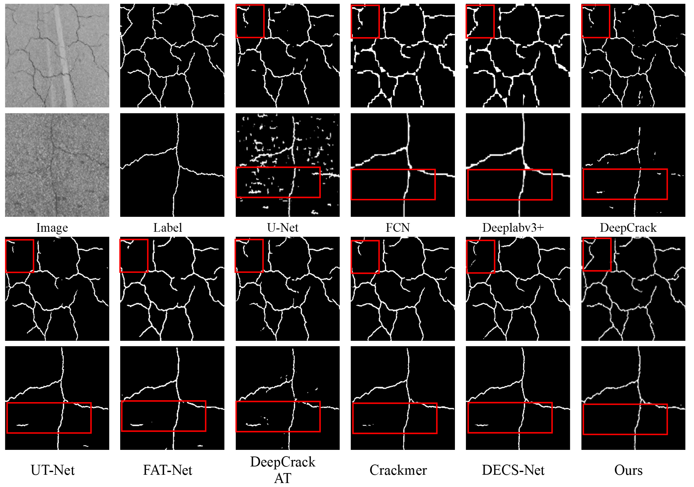
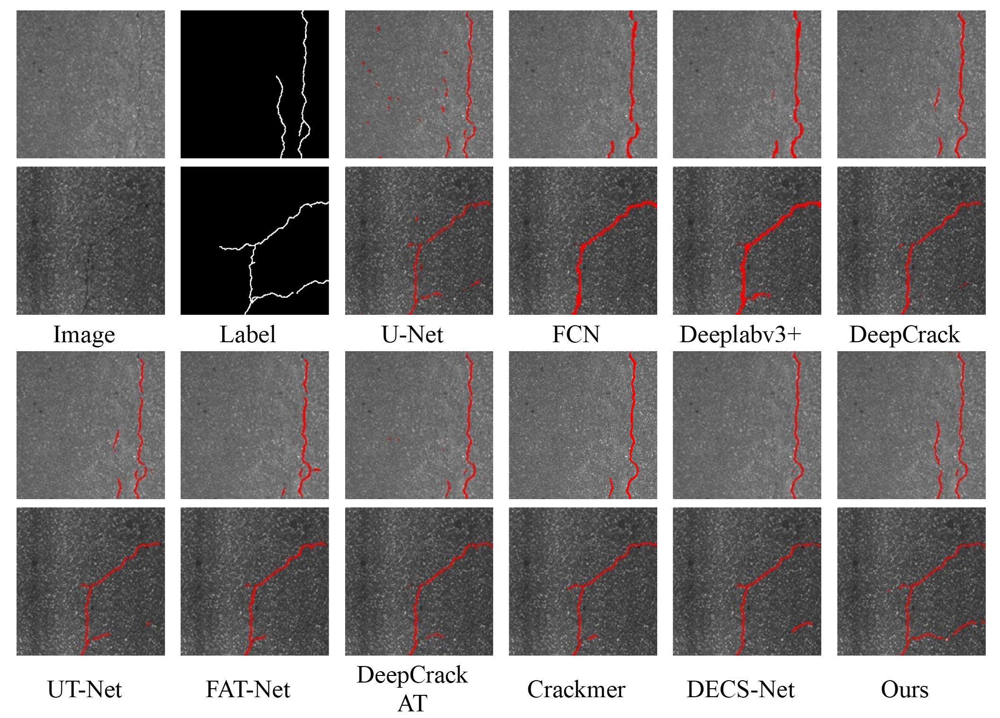
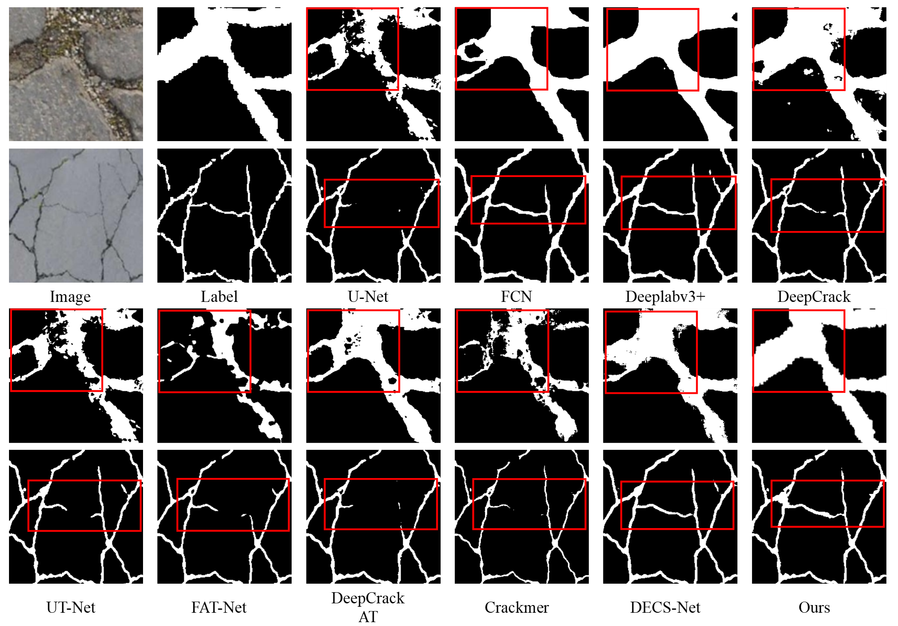

# FMLF-Net
FCLG-Net: Frequency Multi-angle Compensation and Low-resolution Guided Network for Pavement Crack Segmentation.

The paper is currently under submission. Once the paper is accepted, all code will be made publicly available. Stay tuned for updates! 🚀

  
# 📸 Qualitative Results

🔹 The segmentation results of different methods on the CrackTree260 Dataset

🔹 The segmentation results of different methods on the CrackLS315 Dataset

🔹 The segmentation results of different methods on the Crack760 Dataset

# Download Datasets

crackTree260: https://1drv.ms/f/s!AittnGm6vRKLyiQUk3ViLu8L9Wzb

crackLs315: https://1drv.ms/f/s!AittnGm6vRKLtylBkxVXw5arGn6R 

Crack760: https://drive.google.com/open?id=1cplcUBmgHfD82YQTWnn1dssK2Z_xRpjx

# Run Train
  python train.py
  
# Run Test
  python test.py

